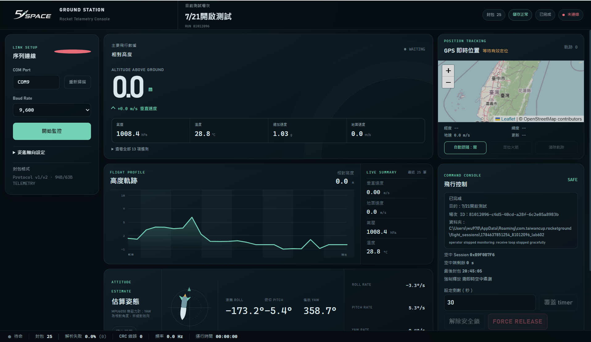
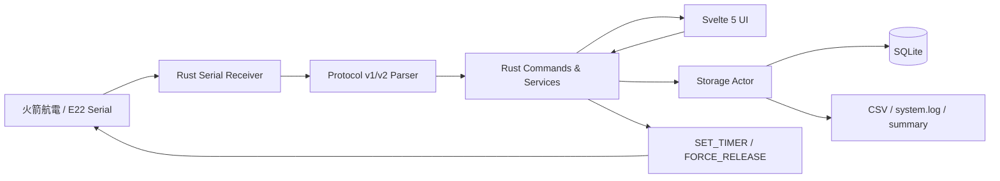

# 2026 Taiwan Cup — 五限可能 Ground Station


> 2026 台灣盃火箭競賽「五限可能」地面站監控系統：給地面站操作員即時接收、視覺化、記錄與安全控制火箭遙測資料。

本專案是以 **Tauri v2 + Rust + Svelte 5** 開發的 Windows 桌面應用程式，透過序列埠接收 E22 無線鏈路下傳的遙測，並提供 GPS、姿態估算、雙向倒數控制、強制釋放安全鎖與可稽核的場次資料保存。

最新 portable 版本：[GitHub Releases](https://github.com/John-owo/-2026-TaiwanCup-Rocket-Ground-Station/releases/latest) · 最新驗證版本 `v0.1.3`

## 畫面預覽



畫面由左至右包含序列連線與測試設定、主要遙測與高度軌跡、GPS 位置，以及 timer／安全控制。頂部與底部狀態列會持續顯示場次、儲存、連線、封包與錯誤狀態。

## 目錄

- [快速開始](#快速開始)
- [功能總覽](#功能總覽)
- [畫面配置](#畫面配置)
- [安裝與開發](#安裝與開發)
- [遙測封包格式](#遙測封包格式)
- [操作限制與注意事項](#操作限制與注意事項)
- [技術架構](#技術架構)
- [貢獻](#貢獻)
- [授權](#授權)

## 快速開始

### 直接使用 Windows portable 版本

1. 從 [最新 GitHub Release](https://github.com/John-owo/-2026-TaiwanCup-Rocket-Ground-Station/releases/latest) 下載 `.exe`、`.json` 與 `.sha256`。
2. 先核對 checksum，再開啟 portable `.exe`。目前最新驗證檔案為 `GroundStation_0.1.3_Portable_2026-07-20_230808.exe`。
3. 接上地面端序列裝置，開啟程式後掃描並選擇 COM Port 與正確 Baud Rate。
4. 按「開始監控」，填寫測試目的、操作者、地點與起始電池電壓；確認後才會開啟 COM、建立 UUID 場次並開始接收。

PowerShell checksum 核對範例：

```powershell
Get-FileHash .\GroundStation_0.1.3_Portable_2026-07-20_230808.exe -Algorithm SHA256
Get-Content .\GroundStation_0.1.3_Portable_2026-07-20_230808.sha256
```

目前 release metadata 與 checksum 也保存在 [`artifacts/`](artifacts/)；最新檔名與 release tag 見 [`artifacts/LATEST.txt`](artifacts/LATEST.txt)。`.exe` 不提交到一般 Git 歷史，只透過版本化 GitHub Release 發布。

### 操作流程

1. 確認 E22／序列裝置、空中端電源與測試負載已依硬體測試計畫就緒。
2. 在左側選擇 COM Port、Baud Rate，必要時按「重新掃描」。
3. 按「開始監控」並完成不可略過的場次資料視窗。
4. 先確認遙測、儲存狀態、session 與最後封包時間，再進行 timer 或其他控制操作。
5. 測試結束按「停止監控」；正常中斷的場次標記為 `completed`，異常關閉或重啟復原的場次標記為 `interrupted`。

## 功能總覽

| 功能 | 說明 |
|------|------|
| 🔌 序列埠連線管理 | 開始監控前先填寫場次資料；確認後才原子地開啟 COM、建立場次並接收 |
| 📡 即時遙測接收 | 解析 Protocol v1／v2 二進位 frame，驗證 CRC-16 後更新 UI |
| 📊 遙測圖表 | 以相對高度為主視覺，同時顯示垂直速度、地速、氣壓與溫度 |
| 🧭 姿態估算 | 以 MPU6050 陀螺儀積分與加速度門控估算 Roll／Pitch；Yaw 是相對航向，沒有磁力計絕對校正 |
| 🗺️ GPS 即時地圖 | 使用 Leaflet／OpenStreetMap 顯示位置、軌跡與自動跟隨 |
| 📋 遙測面板 | 分類顯示 13 項 IMU、GPS／導航與環境資料 |
| 📶 連線狀態列 | 顯示待命、等待資料、接收中、失聯、封包、解析失敗、CRC、頻率與連線時間 |
| 💾 可靠資料記錄 | 以 FIFO writer 保存 SQLite、`flight_data.csv`、`system.log` 與場次摘要 |
| ⏱️ 雙向飛行控制 | 支援 `SET_TIMER`／`FORCE_RELEASE`、ACK 配對、重送與 session 重啟同步 |
| 🗂️ 場次管理 | 每次確認監控自動建立 UUID 場次，不需要另按「開始新場次」 |
| 📉 通訊統計 | 分開統計遺失、重複、CRC 錯誤、失聯區間、最長失聯與重啟次數 |

## 畫面配置

| 區域 | 主要內容 |
|------|----------|
| 頂部列 | 隊徽、目前測試場次、儲存狀態、場次狀態、連線狀態與封包數 |
| 左側欄 | COM Port／Baud Rate、開始／停止監控、姿態軸向設定與協定摘要 |
| 中央上方 | 相對高度、垂直速度、氣壓、溫度、總加速度與地面速度 |
| 中央中段 | 高度軌跡、即時摘要與最近遙測資料 |
| 中央下方 | Roll／Pitch／Yaw 姿態估算與角速度；Yaw 明確標示為相對航向 |
| 右側上方 | GPS 位置、軌跡、自動跟隨、定位與清除軌跡 |
| 右側下方 | 空中端 timer、session、剩餘時間、DEPLOY 狀態與 FORCE RELEASE 安全控制 |
| 底部列 | link 四態、封包／解析／CRC 統計、近期接收頻率與執行時間 |

## 安裝與開發

### 環境需求

| 工具 | 版本 | 用途 |
|---|---|---|
| Windows | Windows desktop | Tauri portable 執行環境 |
| Node.js | ≥ 18 | 前端建置與測試 |
| pnpm | 支援 lockfile v9 | 前端套件管理；請使用 frozen lockfile |
| Rust | ≥ 1.77.2 | Rust／Tauri 後端編譯 |
| Tauri CLI | v2 | 開發模式與 Windows no-bundle release build；由 `src-ui` devDependency 提供 |

Rust 可由 [rustup.rs](https://rustup.rs/) 安裝；pnpm 可用 `npm install -g pnpm` 安裝。Windows 開發環境亦須具備 Tauri 所需的 WebView2 與 C++ build tools。

### 安裝相依套件

從本 repository 根目錄 `ground_station/` 執行：

```powershell
Set-Location .\src-ui
pnpm install --frozen-lockfile
Set-Location ..
```

### 開發模式

```powershell
& ".\src-ui/node_modules/.bin/tauri.CMD" dev
```

Tauri 會依 `src-tauri/tauri.conf.json` 自動啟動 `src-ui` 的 Vite server（port `8000`）與原生視窗。

### 測試、檢查與 production build

```powershell
pnpm --dir .\src-ui test
pnpm --dir .\src-ui check
pnpm --dir .\src-ui build
cargo test --locked --manifest-path .\src-tauri/Cargo.toml
cargo check --locked --manifest-path .\src-tauri/Cargo.toml
```

目前前端測試由 `src-ui/package.json` 的 `test` script 執行；`check` 同時執行 `svelte-check` 與 TypeScript 檢查。

### Windows no-bundle release build

完成上方測試與檢查後，從 `ground_station/` 執行：

```powershell
& ".\src-ui/node_modules/.bin/tauri.CMD" build --no-bundle --config .\src-tauri/tauri.workspace-build.json
```

產物位於 `src-tauri/target/release/app.exe`。應用程式或 UI 變更的 release 流程還需要：

1. 將產物複製為 `artifacts/GroundStation_<version>_Portable_<YYYY-MM-DD_HHMMSS>.exe`。
2. 建立同名 `.json` manifest 與 `.sha256` checksum，更新 `artifacts/LATEST.txt`。
3. `.exe` 不加入 Git；原始碼與 metadata commit／push 後，把 `.exe`、manifest 與 checksum 上傳到新的版本化 GitHub Release。
4. 從 GitHub Release 重新下載全部資產，核對 release 狀態、檔名、大小與 SHA-256 後，才可宣告 release 完成。

最新已驗證 metadata：[`GroundStation_0.1.3_Portable_2026-07-20_230808.json`](artifacts/GroundStation_0.1.3_Portable_2026-07-20_230808.json)。驗證包含 frontend 48 passed、Svelte／TypeScript 0 errors／0 warnings、production build、Rust 31 passed、`cargo check --locked`、SQLite migration readback 與 Tauri no-bundle build。

## 遙測封包格式

地面站同時解析 Protocol v1／v2，並依最近一包有效 telemetry 的版本選擇上行指令格式。完整欄位、定點尺度、ACK 結果碼與 golden vectors 請看：

- [Protocol v1 完整規格](docs/protocol/PROTOCOL_V1.md)
- [Protocol v2 完整規格](docs/protocol/PROTOCOL_V2.md)
- [共同測試向量與驗證方式](docs/protocol/README.md)

### v1／v2 摘要

| 項目 | Protocol v1 | Protocol v2 |
|---|---:|---:|
| Common header | 20 bytes | 14 bytes |
| `TELEMETRY` 完整 frame | 94 bytes | 63 bytes |
| `SET_TIMER` 完整 frame | 26 bytes | 20 bytes |
| `FORCE_RELEASE` 完整 frame | 22 bytes | 16 bytes |
| `ACK` 完整 frame | 30 bytes | 23 bytes |
| 感測資料編碼 | Big-endian IEEE-754 `float32` | Big-endian fixed-point integer |
| 地面站相容性 | 可解析 | 正式空中端格式；地面站仍保留 v1 parser |

兩版共同使用 `A5 5A` magic、big-endian 欄位與 **CRC-16/CCITT-FALSE**：多項式 `0x1021`、初始值 `0xFFFF`、MSB-first，計算範圍為 `version` 到 payload 結尾，不包含 magic 與 CRC 本身。

### 遙測單位

| 資料群組 | 欄位 | 單位 |
|---|---|---|
| IMU 加速度 | X／Y／Z | m/s² |
| IMU 角速度 | X／Y／Z | °/s |
| GPS／導航 | 經度、緯度 | ° |
| GPS／導航 | 高度、地速、垂直速度 | m、m/s、m/s |
| 環境 | 氣壓、溫度 | hPa、°C |

Protocol v2 的有效旗標與定點溢位規則由 parser 處理；無效感測欄位不應被當成有效的零值。

### 雙向時序摘要

- 正式空中端 telemetry 週期：`1800 ms`。
- 地面站失聯門檻：`4500 ms`。
- 地面站只在完整 telemetry 後 `150–299 ms` 的上行窗傳送一次待執行指令；沒有待送指令時不持續發送。
- ACK 遺失時，等待下一包 telemetry 再重送；同一邏輯指令保留 command ID。
- `FORCE_RELEASE` 優先於 timer；timer 只保留最新值。
- 新 session 出現時，舊 ACK 不得改變狀態；最新 timer 會重建，FORCE 不跨 session 自動重放。

## 操作限制與注意事項

### 賽前檢查清單

- [ ] 已讀取並記錄兩顆 E22-900T22D 的 UART、空中速率、頻道、位址、NETID、功率、分包長度與 LBT 設定。
- [ ] 已確認 M8N 實際 UART baud 與空中端韌體一致，且能持續輸出有效 NMEA。
- [ ] 已確認兩塊 ESP32 使用正確且分離的 COM Port；RF 台架測試時 ESP32 #2 不接 USB，改用外部電源並共地。
- [ ] 開始正式場次前，頂部儲存狀態為正常，且已確認 SQLite／CSV／Log 路徑。
- [ ] 已讓 MPU6050 靜止並完成姿態歸零；每次只繞一個實體軸檢查方向。
- [ ] 已確認最近 telemetry、airborne session 與最後封包時間均為有效值。
- [ ] 若要設定 timer，已先確認空中端狀態為 `SAFE` 且 session 未變更。
- [ ] `FORCE RELEASE` 僅在有效 live telemetry 時解除安全鎖，操作前已確認安全假負載與人員清場。

### Timer、FORCE RELEASE 與 session 安全規則

- `SET_TIMER` 會直接覆蓋空中端目前剩餘時間與尚未送出的舊 timer。
- 空中端失聯後仍依最後一次 ACK 的 timer 倒數；遙測感測值不會觸發開傘。
- 開傘來源只有 timer 歸零與地面站 `FORCE_RELEASE`。`MPU6050`、`BMP280`、GPS 或其他感測值不得作為開傘條件。
- FORCE 按鈕平時鎖定，只有最近 `4500 ms` 內收到有效 telemetry 且 session 未變更時可解除；失聯、斷線或 session 改變會立即重新上鎖。
- 解除安全鎖後單擊即送出一次 FORCE，後端不會保存無 live session 的 FORCE 等待日後重播；空中端已 `DEPLOYED` 後不得回到 `SAFE`。
- MPU6050 INT 實體斷接；空中端只可透過 I2C polling（SDA `GPIO4`、SCL `GPIO5`）讀取，`GPIO20` 保留給 ESP32-S3 native USB D+，不得作為應用 GPIO。

### 場次資料與磁碟空間

- 測試目的、操作者、地點與起始電池電壓必填，備註選填；取消場次視窗不會開 COM 或建立場次。
- 儲存失敗時預設禁止正式場次；只有操作員明確承認資料不會保存，才可進入僅監控模式。
- 剩餘空間低於 `512 MiB` 顯示警告／降級，低於 `128 MiB` 禁止新正式場次。
- 正常停止會排空 writer 並標記 `completed`；程式異常、關閉或重啟復原標記 `interrupted`，不自動刪除既有資料。
- `flight_data.csv` 保存逐封包資料；`system.log` 記錄連線、失聯、CRC、指令、ACK、重啟、DEPLOYED 與錯誤事件。

### 姿態與 GPS 使用限制

- MPU6050 沒有磁力計，Yaw 是相對航向，會隨時間漂移，不可當作真北航向。
- GPS 地圖需要網路；圖磚載入失敗不會停止 GPS 數值、序列埠或其他遙測。
- 地圖使用 OpenStreetMap 標準圖磚並保留 attribution；不提供背景預抓、批次下載或離線圖磚。

自動化測試不能取代 E22 半雙工、伺服、假負載與實際開傘機構的現場驗證；完整步驟由團隊硬體測試計畫另行維護。

## 技術架構

README 只保留系統邊界與資料流摘要；逐檔案說明、儲存生命週期、命令排程與測試邊界見 [`docs/ARCHITECTURE.md`](docs/ARCHITECTURE.md)。



### 專案結構

```text
ground_station/
├── src-ui/                    # Svelte 5 + Vite 前端與前端測試
├── src-tauri/                 # Rust／Tauri 後端、serial parser、SQLite migration
├── artifacts/                 # release metadata、checksum、LATEST；portable exe 不入 Git
├── docs/
│   ├── ARCHITECTURE.md        # 詳細分層、資料流與保存流程
│   ├── protocol/              # Protocol v1/v2 規格、vectors 與驗證腳本
│   └── images/main-screen.png # 主畫面預覽
└── README.md
```

## 貢獻

本專案由「五限可能」隊維護，僅限隊內成員修改。提交變更時請：

1. 先確認變更範圍，不要把 `target/`、`node_modules/` 或 `artifacts/*.exe` 加入 Git。
2. 應用程式／UI 變更完成後，依 [安裝與開發](#安裝與開發) 執行 frontend test／check／build、Rust test／check 與 Tauri no-bundle build。
3. 若產生新 release，依本文件的 artifact、metadata、GitHub Release 與下載後 checksum 驗證流程執行。
4. 使用 `feature/` 或 `docs/` 前綴建立工作分支，並在 PR 或 commit 說明驗證證據與硬體測試是否仍待完成。

## 授權

本專案為 2026 台灣盃火箭競賽「五限可能」隊內部使用，第三方套件依各自授權條款使用。
