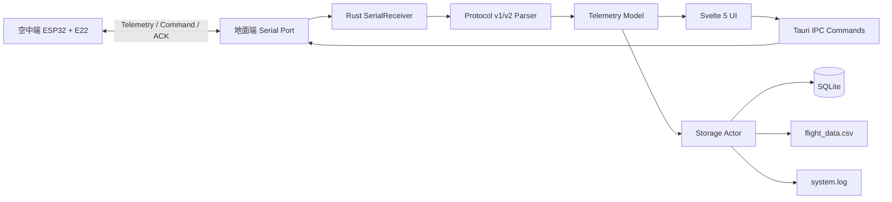
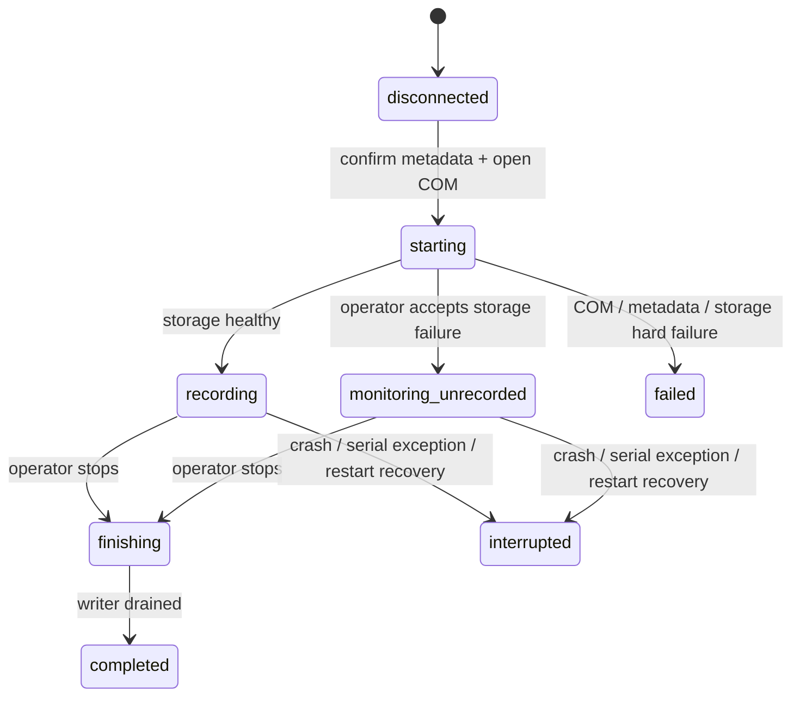

# Ground Station Architecture

這份文件補充 [`README.md`](../README.md) 的技術細節。README 以操作員與新貢獻者為主要讀者；本文件則說明資料流、模組邊界、場次保存與雙向指令時序。

## 1. 系統邊界



地面站只負責接收、驗證、呈現、保存及排程上行指令。感測器估算值只進入遙測，不參與開傘判斷；開傘條件由空中端的 timer 歸零或 `FORCE_RELEASE` 決定。

## 2. Repository layout

| 路徑 | 責任 |
|------|------|
| `src-ui/` | Svelte 5 UI、Vite 設定、前端單元測試與 production build |
| `src-tauri/` | Tauri v2 shell、Rust command／service／infrastructure／state、SQLite migration |
| `src-tauri/src/commands/` | 對前端公開的開始／停止場次、序列埠、timer、FORCE 與歷史資料命令 |
| `src-tauri/src/services/` | `Parser`、`Receiver`、frame decoder 與 notification trait 邊界 |
| `src-tauri/src/infrastructures/serial/` | CRC、stream parser、frame encoder、非同步 serial receiver |
| `src-tauri/src/infrastructures/flight.rs` | 地面站上行 command queue、ACK 配對與 session 變更策略 |
| `src-tauri/src/state/serial_state.rs` | COM、receiver cancellation、command channel、統計與場次狀態 |
| `src-tauri/src/state/storage_state.rs` | 單一 FIFO writer、SQLite／CSV／Log sink、磁碟檢查與復原 |
| `src-tauri/src/models/response.rs` | telemetry、command、ACK、storage 與 test session DTO |
| `src-ui/src/App.svelte` | 主畫面 layout 與前後端事件初始化 |
| `src-ui/src/components/` | 連線、場次、遙測、圖表、GPS、姿態、飛控與狀態列元件 |
| `src-ui/src/lib/` | Tauri IPC bridge、Svelte store、姿態／GPS／設定／link 純邏輯與測試 |
| `artifacts/` | release manifest、checksum、`LATEST.txt`；portable `.exe` 不進 Git |

## 3. Backend layering

```text
Tauri Commands
    ↓
Services / Traits
    ↓
Infrastructure I/O and protocol implementations
    ↕
Thread-safe State
    ↕
Models / DTOs
```

### Commands

`src-tauri/src/commands/serial.rs` 是地面站場次與序列埠的協調入口，負責：

- 原子地處理 COM 開啟、測試 metadata、UUID 場次與 receiver 啟動。
- 暴露 `list_serial_ports`、`start_test_monitoring`、`stop_test_monitoring`、`get_test_session_status` 與 `get_storage_status`。
- 暴露 `get_telemetry_history`、`get_flight_stats`、`set_timer` 與 `force_release`。
- 確保取消場次、序列異常、程式退出與既有未完成場次復原時都有明確狀態。

### Serial parser and receiver

`src-tauri/src/infrastructures/serial/parser.rs` 以 stream parser 處理可能被切段、黏包或含雜訊的 UART bytes：

1. 搜尋 `A5 5A` magic。
2. 讀取對應版本的 header 與 payload length。
3. 等待完整 frame，驗證固定長度、保留 bits 與 CRC-16/CCITT-FALSE。
4. 解碼 v1 big-endian `float32` 或 v2 big-endian fixed-point。
5. 將兩版轉換成相同的 `TelemetryPayload`，再交給 UI、統計與 storage。
6. frame 錯誤時從下一個可能的 magic 重新同步，不讓單一錯誤卡住 receiver。

`receiver.rs` 只維持一個主要接收迴圈；合格遙測會送往事件通知、flight statistics 與單一 FIFO writer。儲存 queue 滿載時回報遺失寫入，但不阻塞遙測畫面與安全控制。

### Protocol and flight command queue

`src-tauri/src/infrastructures/flight.rs` 維持地面站的邏輯指令狀態：

- 等待有效 telemetry 與 session 後才可上行。
- 每包完整 telemetry 後只開放一次 `150–299 ms` 上行窗。
- 未收到相符 ACK 時等下一包 telemetry 重送；同一邏輯指令保留 command ID。
- 新 timer 取代舊 timer；`FORCE_RELEASE` 永遠優先。
- ACK 必須同時符合目前 session 與待送 command ID；舊 session／舊 ID 只記錄，不改 UI 狀態。
- 偵測新 airborne session 時，自動重建最新 timer；FORCE 不跨 session 自動重播。
- telemetry 的 `last_ack_command_id`／result 可在獨立 ACK 遺失時完成配對。

### Storage actor

`src-tauri/src/state/storage_state.rs` 將每包遙測與事件交給同一個 FIFO writer，避免每包各自建立非受控背景 task。保存流程如下：

```text
Telemetry / Event
    → bounded FIFO
    → SQLite migration-backed sink
    → flight_data.csv sink
    → system.log / session_summary.json
```

儲存狀態至少分為初始化、正常、降級與失敗。SQLite 不可初始化時不得靜默改用記憶體資料庫；SQLite 單一 sink 失敗仍須標示降級並保存可用的 CSV／Log。queue 滿載或所有主要 sink 失敗時，UI 必須顯示失敗及遺失寫入數。

每場開始前與執行中會檢查磁碟空間：低於 `512 MiB` 警告／降級，低於 `128 MiB` 阻止新的正式場次。正常停止會排空 writer 並標記 `completed`；異常關閉、序列錯誤或啟動復原標記 `interrupted`。

## 4. Frontend structure

### Application shell

`src-ui/src/App.svelte` 使用桌面三欄 layout：

- 頂部列：隊徽、場次 identity、storage／run／connection chip。
- 左側欄：`ConnectionPanel`，負責 COM、Baud、姿態軸向與開始／停止監控。
- 中央：`TelemetryGrid`、`TelemetryCharts`、`AttitudeIndicator`。
- 右側欄：`GpsMap` 與 `FlightControlPanel`。
- 底部：`StatusBar`，顯示 link 四態與統計。

低高度 desktop viewport 由主內容捲動；窄視窗改為單欄堆疊，避免遙測卡片、GPS 或飛控按鈕被裁切。

### Components

| 元件 | 職責 |
|------|------|
| `ConnectionPanel.svelte` | 掃描／選擇 COM 與 Baud、保存姿態軸向、請求開始／停止場次 |
| `TestSessionDialog.svelte` | 強制蒐集測試目的、操作者、地點、起始電壓與備註；儲存失敗時要求明確承認僅監控 |
| `TelemetryGrid.svelte` | 顯示 13 項已還原的 IMU、GPS／導航與環境數值 |
| `TelemetryCharts.svelte` | 以 SVG 顯示最近高度、垂直速度、地速、氣壓與溫度資料 |
| `AttitudeIndicator.svelte` | 顯示 Roll／Pitch／相對 Yaw 與三軸角速度；每個 telemetry revision 只更新一次 |
| `GpsMap.svelte` | 驗證 GPS 座標、更新 Leaflet marker、維護最多 5,000 點軌跡 |
| `FlightControlPanel.svelte` | 顯示 timer／session／deploy 狀態，管理安全鎖、timer 與 FORCE 操作 |
| `StatusBar.svelte` | 顯示待命／等待／接收／失聯、解析失敗、CRC、頻率與執行時間 |

### Stores and bridge

`src-ui/src/lib/tauri.ts` 集中包裝 Tauri `invoke`／`listen`；`stores.svelte.ts` 保存遙測快照、每包 revision、圖表 ring buffer、link／storage／session／command／flight stats。純邏輯測試則放在 `src-ui/src/lib/*.test.mjs`，讓姿態、GPS、session、command queue 與 UI copy 不必依賴原生視窗即可驗證。

## 5. Session lifecycle



開始監控的確認、COM、場次 UUID 與 writer 啟動由後端一次協調；取消表單或 COM 開啟失敗不應留下空場次。航空端暫時失聯不會自動結束地面場次，只有場次操作或程序生命週期事件會改變場次狀態。

## 6. Safety boundaries

- 地面站的 FORCE 只能在 live telemetry／current session 條件成立時解鎖。
- 新 session 會取消舊 FORCE pending；最新 timer 可以重建，避免將舊 session 的強制動作帶到重啟後的空中端。
- 空中端已 `DEPLOYED` 時，地面站不再送無效 timer，空中端也不得回到 `SAFE`。
- 感測資料只作為 telemetry 與 UI 顯示；不得以 MPU6050、BMP280、GPS 或其他感測值觸發開傘。
- MPU6050 INT 實體斷接；正式硬體只使用 SDA `GPIO4`／SCL `GPIO5` I2C polling，`GPIO20` 保留給 ESP32-S3 native USB D+。

## 7. Verification map

| 層級 | 命令 | 覆蓋內容 |
|------|------|----------|
| Protocol | root avionics repo 的 vectors verifier | v1／v2 frame、CRC、定點邊界與 duplicate semantics |
| Frontend | `pnpm --dir .\src-ui test` | 姿態、GPS、session、flight control、link、UI copy、repository policy |
| Frontend check | `pnpm --dir .\src-ui check` | Svelte diagnostics 與 TypeScript |
| Frontend build | `pnpm --dir .\src-ui build` | Vite production bundle |
| Rust | `cargo test --locked --manifest-path .\src-tauri/Cargo.toml` | parser、flight queue、storage、migration 與統計 |
| Rust check | `cargo check --locked --manifest-path .\src-tauri/Cargo.toml` | release 前型別與相依檢查 |
| Windows release | Tauri `build --no-bundle` | `src-tauri/target/release/app.exe` portable 殼 |

自動驗證通過不等於硬體驗證完成；E22 半雙工、伺服一次性動作、FORCE 假負載與端到端 UI 對照仍須依硬體測試計畫執行。
